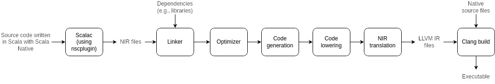

# Scala Native

Scala Native is an ahead-of-time compiler and runtime designed for
Scala. It makes it possible to integrate low-level code with Scala code
and compile them to machine code (using LLVM), which will run natively
on the host machine, instead of running on the JVM.

The goal of Scala Native is to reduce the memory usage overhead of the
JVM that is the result of the JIT compiler and the dynamic class loading
[@scalanativeInternals]. Given that Scala Native compiles code directly
to machine code before its execution and this code gets executed
natively on the host machine, the startup time of Scala Native programs
is significantly lower than Scala programs that run on the JVM. Scala
Native also offers the possibility to interoperate with low-level
languages such as C.

Scala Native is going to be used in my thesis in order to optimize
analyses created by MAF, given that MAF is implemented using Scala.

# The Scala Native Pipeline

Understanding how Scala Native works allows us to understand the meaning
of the different errors that we might encounter while writing code with
Scala Native. Thus, understanding the pipeline helps us write better
code with Scala Native.

Compiling Scala code with Scala Native to an executable happens in
multiple phases [@scalanativeInternals; @scalanativeinternals_2]. These
phases are illustrated in Figure [1](#sn-pipeline){reference-type="ref"
reference="sn-pipeline"}.



### Scala Code Compilation to NIR

Native Intermediate Representation (NIR) is a representation which
consists of a subset of LLVM IR instructions and values, enriched by
instructions to represent high-level operands, such as classes and
traits, and operations, such as classOf [@sn_contr].

One of the main advantages of NIR is that it is strongly typed. It
stores for example additional information about a given class that is
stored in the memory. This allows the optimiser to perform more
optimisations on the compiled code.

The first stage of the pipeline is compiling the Scala source code to
NIR. This happens by the `nscplugin`, which is a plugin for Scala Native
that attaches to the Scala compiler. The plugin inspects the abstract
syntax tree of the Scala sources and generates `.nir` files.

### Linking the NIR Sources

After compiling all the Scala sources to NIR, the linker will then join
all the `.nir` files that were produced by the plugin, as well as `.nir`
files of external libraries on which the project depends.

### Optimizing The Code

Once all the NIR sources are linked, the optimizer will optimize them.
An example of these optimisations is partial evaluation, which will
evaluate instructions that have predictable results at compile time
[@shabalin2018interflow].

### Translating NIR Sources to LLVM IR

After optimizing the NIR code, additional code will be generated, such
as the entry point of the program, which contains the entry point
defined by the user along with the preparation of the context execution,
such as initializing some classes that need to be initialized. virtual
method tables will also be created in the code generation phase.

After that, the NIR high level instructions will be translated to
low-level instructions that can be understood by the LLVM compiler, and
the LLVM IR headers will be added to the code.

### Building an Executable

Once the Scala code is compiled to LLVM IR, the LLVM compiler will
compile the native sources together with the LLVM IR sources, and will
link them to build the application.

# Scala Native Memory Management

Scala Native comes with a garbage collector (Boehm GC [^1]) that
automatically manages memory for objects. This garbage collector is
built to run natively on the host machine.

Memory can also be manually allocated for C types [@sn]. This could be
useful to interact with external C functions that have pointers as
arguments, or to improve the performance of a Scala Native program by
minimizing the amount of work the garbage collector has to do. The state
of the instances of a class that is frequently used can for example be
encoded in a byte sequence and manually stored in the memory, reducing
the amount of work of the garbage collector, which might improve the
performance of the program.

This is different than the Scala memory model, which relies on the JVM
memory model. Given that Scala is compiled with the just-in-time
compiler to Java Byte Code which will run on a JVM, the JVM will load
classes dynamically at run time to the heap memory. Generally, the JVM
will store all objects on the heap memory. Variables are references to
those objects, and can be stored on the stack, e.g., when calling a
function which has local variables [@JVMspecs]. The garbage collection
is taken care of by the JVM. Scala has no way of manually allocating
memory.

## Manual Memory Allocation for C Types

### Heap Memory Allocation

Heap memory can be dynamically allocated in Scala Native using the
bindings that Scala Native offers for the C functions that perform
dynamic heap memory manipulation [@sn]. These functions are `malloc`,
`free` and `realloc`. Using these functions, memory from the heap can be
dynamically allocated and freed once it is no longer needed. It is the
responsibility of the programmer to free the dynamically allocated heap
memory; the program will have otherwise memory leaks. Section
[4.1](#scala-native-example){reference-type="ref"
reference="scala-native-example"} demonstrates how C types can be stored
on manually allocated memory on the heap.

### Stack Memory Allocation

It is possible to manually allocate memory on the stack inside a given
method [@sn]. This can be useful given than the stack memory is faster
than the heap memory. The allocated stack memory will be freed once the
method in which they are allocated returns. Section
[4.2](#stack-allocation-example){reference-type="ref"
reference="stack-allocation-example"} demonstrates how C types can be
stored on manually allocated memory on the stack.

### Zone Allocation

Zones are another way to perform memory allocations [@sn]. Using zones,
memory can be temporarily allocated for C types on the zone heap, and
once the execution leaves the defined zone, the zone allocator will free
all the memory allocated inside that zone. Section
[4.3](#zone-allocation-example){reference-type="ref"
reference="zone-allocation-example"} demonstrates how zones can be used
for semi-automatic memory management.

# Features of Scala Native

## Low-level Primitives {#primitives}

Scala Native provides built-in equivalents of most C data types and
pointers. A complete list can be found in the documentation of the
`scala.scalanative.unsafe` package[^2]. Table
[1](#primitive-types){reference-type="ref" reference="primitive-types"}
shows a list of the most popular ones, alongside their Scala Native
equivalent.

::: {#primitive-types}
  **C type**                **Scala Native**
  ------------------------- ---------------------------------------------------------------------
  `void`                    `Unit`
  `int`                     `unsafe.CInt`
  `int*`                    `unsafe.Ptr``[``unsafe.Int``]`
  `long`                    `unsafe.CLong`
  `char`                    `unsafe.CChar`
  `char`\*                  `unsafe.CString`
  `struct { int x, y; }*`   `unsafe.Ptr``[``unsafe.CStruct2``[``unsafe.CInt, unsafe.CInt``]``]`

  : Popular C types and their Scala Native equivalent.
:::

Scala Native has also support for pointer operations, such as
dereferencing a pointer variable. These operations and their Scala
Native equivalents can be found in Table
[2](#pointer-ops){reference-type="ref" reference="pointer-ops"} [@sn].

::: {#pointer-ops}
  **Operation**                           **C syntax**               **Scala Native syntax**
  --------------------------------------- -------------------------- -------------------------
  Load a value from an address            `*ptr`                     `!ptr`
  Store a value to a given address        `*ptr = value`             `!ptr = value`
  Pointer to an index                     `ptr + i; &ptr``[``i``]`   `ptr + i`
  Load a value from an index              `ptr``[``i``]`             `ptr(i)`
  Store a value to an index               `ptr``[``i``]`` = value`   `ptr(i) = value`
  Pointer to a field of a struct          `&ptr->name`               `ptr.atN`
  Load a value from a field of a struct   `ptr->name`                `ptr._N`
  Store a value to a field of a struct    `ptr->name = value`        `ptr._N = value`

  : Pointer operations in C and their Scala Native equivalent.
:::

::: tablenotes
N is the index of that field in the struct.
:::

Having low-level primitives with pointer operations integrated in Scala
Native allows us to directly write low-level code in Scala code, instead
of relying on an implementation from a low-level language like C.

## Native Code Interoperability

As we have seen from the previous sections, Scala Native offers features
to write low-level code directly in Scala code, such as low-level
primitive types and manual memory management. In Scala Native it is also
possible to interoperate with low-level languages such as C. This could
be useful when using an external C library with Scala Native for
example.

`extern` objects can be used to declare methods that are defined
elsewhere in a native library in the library path, or in the Scala
Native resources. Inside an `extern` object, the binding of the methods,
with which Scala Native interoperates, should be defined. This binding
is the Scala Native equivalent signature of the signature of that method
in its native implementation. Below is an example of such objects. The
`test` method takes two arguments, a C integer, and a pointer to a
null-terminated C string. This method is defined elsewhere in native
code.

``` {.scala language="Scala"}
import scalanative.unsafe._

@extern
object myapi {
    def test(a: CInt, b: CString): Unit = extern
}
```

# Examples {#scala-native-examples}

## A Program in Scala Native {#scala-native-example}

This example demonstrates how low-level primitive types can be used
inside Scala code using Scala Native. `Article` is a class that
represents an article given its title and year. The title and year are
stored dynamically on the heap memory using a C struct. the
`update_article` will update the title and year of that article by
dynamically updating the memory. The goal of this program is to create
an article given its title and release year, print the article, update
the title and the release year, and then free all the heap memory.

``` {.scala language="Scala"}
import scala.scalanative.unsafe._
// Scala Native has bindings for a core subset of the C Standard Library
import scala.scalanative.libc.stdlib.{malloc, free}
import scala.scalanative.libc.string.{strlen, strcpy}
import scalanative.unsigned.UnsignedRichInt
import java.nio.charset.Charset

type struct_article = CStruct2[CInt, CString]

object Struct_factory:
  def make_article_pointer(year: CInt, title: CString): Ptr[struct_article] =
    /* Dynamically allocate heap memory for the struct and title.
     * The pointer returned by malloc needs to be cast to the specific pointer needed,
     * in this case a pointer to a struct_article. */
    val new_article: Ptr[struct_article] = 
      malloc(sizeof[struct_article]).asInstanceOf[Ptr[struct_article]]
      
   // Allocate heap memory for the string, and copy its contents to the allocated memory.
    val stringLength = strlen(title) + 1.toULong
    new_article._2 = malloc(stringLength).asInstanceOf[CString]
    strcpy(new_article._2, title)

    new_article._1 = year
    new_article

class Article(year: CInt, title: CString):
  val struct_pointer = 
    Struct_factory.make_article_pointer(year, title)

  /* A method to free the allocated memory.
   * Pointers need to be cast to a byte pointer.  */
  def free_pointer() =
    free(struct_pointer._2.asInstanceOf[Ptr[Byte]])
    free(struct_pointer.asInstanceOf[Ptr[Byte]])

  def article_year: CInt = struct_pointer._1  
  def article_title: CString = struct_pointer._2

  def update_article(year: CInt, title: CString): Unit =
    struct_pointer._1 = year
    free(struct_pointer._2.asInstanceOf[Ptr[Byte]])
    val stringLength = strlen(title) + 1.toULong
    strcpy(struct_pointer._2, title)

  override def toString(): String = 
  // fromCString will convert the string saved inside the given pointer to a Scala String.
    s"Article \"${fromCString(article_title, Charset.forName("utf-8"))}\" is written in $article_year"

object Main:
  def main(args: Array[String]): Unit =
    val article: Article = Article(2022,
      c"LIFUSO: A Tool for Library Feature Unveiling based on Stack Overflow Posts")
    println(article.toString())
    article.update_article(2023,
      c"Result Invalidation for Incremental Modular Analyses")
    println(article.toString())
    article.free_pointer()
```

Building the program using sbt (by running sbt run) will compile all
classes, link them, generate a binary file, and run that binary. Note
that since a binary file is generated, it does not necessarily need to
run with sbt.

    abdullah@computer:~$ ./program_example--out
    Article "LIFUSO: A Tool for Library Feature Unveiling based on Stack Overflow Posts" is written in 2022
    Article "Result Invalidation for Incremental Modular Analyses" is written in 2023

## A Program with Manual Stack Allocation {#stack-allocation-example}

This examples demonstrates how the stack can be manually allocated given
the type of elements which will be stored and the number of elements. In
this example, an array of ages is allocated on stack and incremented by
one. Then, the fourth element is incremented.

``` {.scala language="Scala"}
import scalanative.unsafe._

// Loop over the allocated memory and increment with 1
def updateAges(ages: Ptr[CInt], numberOfAges: CInt): Unit =
  for(i <- 0 to numberOfAges)
  do
    !(ages + i) = !(ages + i) + 1

/* Increment one element in the allocated memory
 * given its index in the allocated array. */
def updateAge(ages: Ptr[CInt], index: CInt): Unit =
  !(ages + index) = !(ages + index) + 1

def printAges(ages: Ptr[CInt], numberOfAges: CInt): Unit =
  print("Ages are: ")
  for(i <- 0 until numberOfAges)
  do
    print(s"${!(ages + i)} ")
  println()

def generateAges(numberOfAges: CInt): Unit =
  /* Allocate memory on the stack. 
   * All the allocated memory is zeored out. */
  val ages : Ptr[CInt] = stackalloc[CInt](numberOfAges)
  printAges(ages, numberOfAges)
  updateAges(ages, numberOfAges)
  printAges(ages, numberOfAges)
  // increment the 4th element of the array
  updateAge(ages, 4)
  printAges(ages, numberOfAges)
  /* Once the method is finished executing, 
   * all the allocated stack memory will be freed. */

object Main:
  def main(args: Array[String]): Unit =
    val numberOfAges = 10
    generateAges(numberOfAges)
```

Below is the result of executing this example.

    abdullah@computer:~$ ./program_example--out
    Ages are: 0 0 0 0 0 0 0 0 0 0 
    Ages are: 1 1 1 1 1 1 1 1 1 1 
    Ages are: 1 1 1 1 2 1 1 1 1 1 

## A program with Zone Allocation {#zone-allocation-example}

This example demonstrates how the zone allocation can be used. This is
the same example as
[4.2](#stack-allocation-example){reference-type="ref"
reference="stack-allocation-example"}, but this time the memory is
allocated using the zone allocator.

``` {.scala language="Scala"}
import scalanative.unsafe._

def updateAges(ages: Ptr[CInt], numberOfAges: CInt): Unit =
  for(i <- 0 to numberOfAges)
  do
    !(ages + i) = !(ages + i) + 1

def updateAge(ages: Ptr[CInt], index: CInt): Unit =
  !(ages + index) = !(ages + index) + 1

def printAges(ages: Ptr[CInt], numberOfAges: CInt): Unit =
  print("Ages are: ")
  for(i <- 0 until numberOfAges)
  do
    print(s"${!(ages + i)} ")
  println()

def generateAges(numberOfAges: CInt): Unit =
  /* Allocate memory in the zone
   * All the allocated memory is zeored out. */
   Zone { implicit z =>
    val ages : Ptr[CInt] = alloc[CInt](numberOfAges)
    printAges(ages, numberOfAges)
    updateAges(ages, numberOfAges)
    printAges(ages, numberOfAges)
    updateAge(ages, 4)
    printAges(ages, numberOfAges)
    }
    /* When the execution of the Zone is finished
     * the zone allocator will free all the manually
     * allocated memory */

object Main:
  def main(args: Array[String]): Unit =
    val numberOfAges = 10
    generateAges(numberOfAges)
```

## A Program with Native Code Interoperability

This example demonstrates how native code written in C can be called in
Scala code. is the project folder of this example. The C functions are
used to create an array of articles given an array of titles and an
array of strings, and to print an array of articles. In Scala the titles
and years are created and copied to the heap. The pointers of their
respective arrays will then be passed to the C functions that are
declared in the `extern` object and defined elsewhere in a C file.

contains the following code:

``` {.objectivec language="C"}
#include <string.h>
#include <stdlib.h>
#include <stdio.h>

typedef struct article {
    char *title;
    int year;
} Article;

Article *make_article(char *title, int year) {
    Article *new = (Article *)malloc(sizeof(Article));
    new->year = year;
    new->title = (char *)malloc(sizeof(char) * (strlen(title) + 1));
    strcpy(new->title, title);
    return new;
};

void free_article(Article *t) {
    free(t->title);
    free(t);
}

void free_articles(Article **articles, int number_of_articles) {
    for(int i = 0; i < number_of_articles; i++) {
        free_article(articles[i]);
    }
}

Article **read_articles(char *article_titles[], int release_years[], int number_of_articles) {
    Article **output = malloc(sizeof(Article *) * number_of_articles);
    for(int i = 0; i < number_of_articles; i++) {
        output[i] = make_article(article_titles[i], release_years[i]);
    }

    return output;
}

void print_articles(Article **articles, int number_of_articles) {
    for(int i = 0; i < number_of_articles; i++) {
        Article *article = articles[i];
        printf("Article \"%s\" is published on %d\n", article->title, article->year);
    }
}
```

contains the following code:

``` {.scala language="Scala"}
import scalanative.unsafe._
import scala.scalanative.libc.stdlib.{malloc, free}
import scala.scalanative.libc.string.{strlen, strcpy}
import scalanative.unsigned.{ULong, UnsignedRichInt}

type struct_article = CStruct2[CString, CInt]

@extern
object myapi:
  def read_articles(
    article_titles: Ptr[CString], 
    release_year: Ptr[CInt], 
    number_of_articles: CInt): Ptr[Ptr[struct_article]] = extern
  def free_articles(articles: Ptr[Ptr[struct_article]], number_of_articles: CInt): Unit = extern
  def print_articles(artciles: Ptr[Ptr[struct_article]], number_of_articles: CInt): Unit = extern

object Main:
  def main(args: Array[String]): Unit = 
    import myapi._
    val number_of_articles: Int = 3
    
    // Allocate space on the heap for the titles and years.
    val article_titles_heap: Ptr[CString] = 
        malloc(sizeof[CString]).asInstanceOf[Ptr[CString]]
    val release_years_heap: Ptr[CInt]= 
        malloc(sizeof[CInt]*number_of_articles.toULong).asInstanceOf[Ptr[CInt]]
        
    val article_titles: Array[CString] = 
      Array[CString](
        c"Result Invalidation for Incremental Modular Analyses",
        c"A Delta-Debugging Approach to Assessing the Resilience of Actor Programs through Run-time Test Perturbations", 
        c"Towards Tracking Thread Interferences during Abstract Interpretation of Concurrent Programs")
    val release_years: Array[CInt] = Array[CInt](2022, 2020, 2015)

    // copy the titles and years to the heap.
    for(i <- 0 until number_of_articles)
    do
      val stringLength: ULong = strlen(article_titles(i)) + 1.toULong
      article_titles_heap(i) = malloc(stringLength).asInstanceOf[CString]
      strcpy(article_titles_heap(i), article_titles(i))
      release_years_heap(i) = release_years(i)

    // pass the pointers of the arrays to the C functions
    val articles: Ptr[Ptr[struct_article]] = 
        read_articles(article_titles_heap, release_years_heap, number_of_articles)
    print_articles(articles, number_of_articles)
    
    // Free all the heap allocated memory.
    free_articles(articles, number_of_articles)
    for(i <- 0 until number_of_articles)
    do
        free(article_titles_heap(i).asInstanceOf[Ptr[Byte]])
        free(article_titles_heap.asInstanceOf[Ptr[Byte]])
        free(release_years_heap.asInstanceOf[Ptr[Byte]])
```

Executing the generated binary file will print the titles of the
articles and the release year of each one.

``` {.bash language="bash"}
abdullah@computer:~$ ./program_example--out
Article "Result Invalidation for Incremental Modular Analyses" is published on 2022
Article "A Delta-Debugging Approach to Assessing the Resilience of Actor Programs through Run-time Test Perturbations" is published on 2020
Article "Towards Tracking Thread Interferences during Abstract Interpretation of Concurrent Programs" is published on 2015
```

# Project Cross-compilation to Native Code

Scala projects can be configured to be compiled to different platforms.
That is, the Scala code can be compiled to Java bytecode, but it can
also have additional build options to compile it to JavaScript (using
Scala.js) or to native code (using Scala Native). This is called
cross-compilation. It is possible to cross-compile Scala projects to
Scala Native using `sbt-crossproject` [^3]. In order to do so, the
project settings need to be modified. An option to complie MAF using
Scala Native will be added. Therefore, MAF will be used to demonstrate
how to cross-compile a project using Scala Native.

In the following needs to be added:

``` {.scala language="Scala"}
addSbtPlugin("org.portable-scala" % "sbt-scala-native-crossproject" % "1.2.0")
addSbtPlugin("org.scala-native"   % "sbt-scala-native"              % "0.4.9")
```

In the following needs to be added or modified:

``` {.scala language="Scala"}
lazy val maf = crossProject(JVMPlatform, JSPlatform, NativePlatform)
                .Settings(..)
                .jvmSettings(..)
                .jsSettings(..)
                .nativeSettings(
                    Compile / mainClass := Some("maf.cli.runnables.AnalyzeProgram"),
                )

lazy val mafNative = maf.native
```

[^1]: <https://www.hboehm.info/gc/>

[^2]: <https://javadoc.io/doc/org.scala-native/nativelib_native0.4_3/latest/scala/scalanative/unsafe.html>

[^3]: <https://github.com/portable-scala/sbt-crossproject>